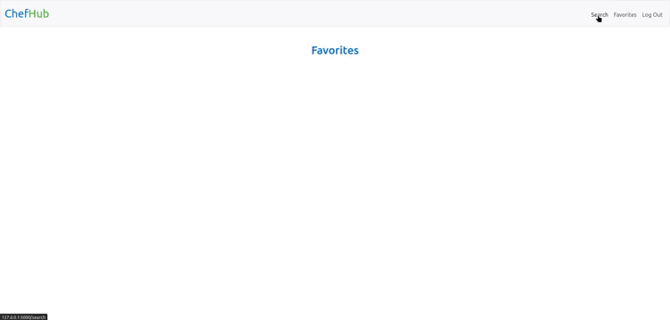

# ChefHub

## CS50
>This IS my final project TO conclude the CS50 Introduction to Computer Sciense course.

>CS, python, flask, flask web framework, web development, CS50
## Features (Must Install)

- [Flask](https://flask.palletsprojects.com/en/3.0.x/)
- [Flask-Session](https://flask-session.readthedocs.io/en/latest/)
- [PyMySQL](https://pymysql.readthedocs.io/en/latest/index.html)
- [Requests](https://pypi.org/project/requests/)

I've used Flask web framework based in Python, it was necessary PyMySQL and requests to manage SQL database with MySQL

## Explaining the project and the database
My final project is a website that allow the user to search and save recipes from the internet using spoonacular API, the user can search and (if logged in) save his favorites recipes

All information about users and favorites for each people are stored in chefhub.db.

I used PyMySQL extension to connect the database to app.py and MySQL to manager her.

### PyMySQL and MySQL:
I needed two tables for my database:

- First, table users. Where I put, id, username and hash (for password), notice that id must be a primary key here.
```sql
CREATE TABLE users (
    id INT NOT NULL AUTO_INCREMENT,
    username CHAR(30),
    hash VARCHAR(255),
    PRIMARY KEY (id),
);
```

- Second, table favorites. I put id, user_id, recipe_id, recipe_name and recipe_img with user_id referencing users(id), the recipe_name and recipe_img are there because the spoonacular API has limit in requests and this avoid making innecesary requests in the favorites page.
```sql
CREATE TABLE favorites (
    id INT NOT NULL AUTO_INCREMENT,
    user_id INT NOT NULL,
    recipe_id INT NOT NULL,
    recipe_name VARCHAR(255),
    recipe_img VARCHAR(255),
    PRIMARY KEY (id),
    FOREIGN KEY(user_id) REFERENCES users(id)
);
```
recipe_name and recipe_img exists because the API has a daily limit of request so adding that data avoids the need of calling the API to show the recipes in Favorites

### Validations for username, password, etc:

If there is a mistake in some step it flash a warning and reset the process

```python
if not request.form.get("username"):
    flash("Must provide a username")
    return render_template("register.html")

elif len(request.form.get("username")) > 30:
    flash("Username must be shorter than 30 characters")
    return render_template("register.html")

elif not request.form.get("password"):
    flash("Must provide a password")
    return render_template("register.html")

elif not request.form.get("confirmation"):
    flash("Must provide a confirmation")
    return render_template("register.html")

elif request.form.get("password") != request.form.get("confirmation"):
    flash("Password and Password Confirmation must be the same")
    return render_template("register.html")

with connection.cursor() as cur:
    cur.execute("SELECT * FROM users WHERE username = %s", request.form.get("username"))

    if cur.rowcount != 0:
        flash("Username alredy exists")
        return render_template("register.html")
    
    cur.execute("INSERT INTO users (username, hash) VALUES (%s, %s)", (request.form.get("username"), generate_password_hash(request.form.get("password"))))
    connection.commit()

    return redirect("/")
```

### Adding and removing favorites.

If the combination of user_id and recipe_id alredy exist it's removed if it doesn't it get's added.

```python
if len(session):
    with connection.cursor() as cur:
        cur.execute("SELECT * FROM favorites WHERE user_id = %s AND recipe_id = %s", (session["user_id"], str(id)))
        if cur.rowcount == 1:
            favorite = True
        else:
            favorite = False
        if request.method == "POST":
            print("stop")
            if favorite:
                cur.execute("DELETE FROM favorites WHERE user_id = %s AND recipe_id = %s", (session["user_id"], id))
            else:
                cur.execute("INSERT INTO favorites (user_id, recipe_id, recipe_name, recipe_img) VALUES (%s, %s, %s, %s)", (session["user_id"], id, dataRecipe['title'], dataRecipe['image']))
            connection.commit()
            return redirect(url_for("recipe", id=id))
        else:
            return render_template("recipe.html", recipe=dataRecipe, favorite=favorite)
```

| 


## Demonstration on youtube
For the CS50 final project you have to make a video showning your project,
[CS50 Final Project - Inti Vazquez](https://www.youtube.com/watch?v=yeIu4NTSLqg)


## About CS50
CS50 is a openware course from Havard University and taught by David J. Malan

Introduction to the intellectual enterprises of computer science and the art of programming. This course teaches students how to think algorithmically and solve problems efficiently. Topics include abstraction, algorithms, data structures, encapsulation, resource management, security, and software engineering. Languages include C, Python, and SQL plus students’ choice of: HTML, CSS, and JavaScript (for web development).

Thank you for all CS50.

- Where I get CS50 course?
https://cs50.harvard.edu/x/2020/